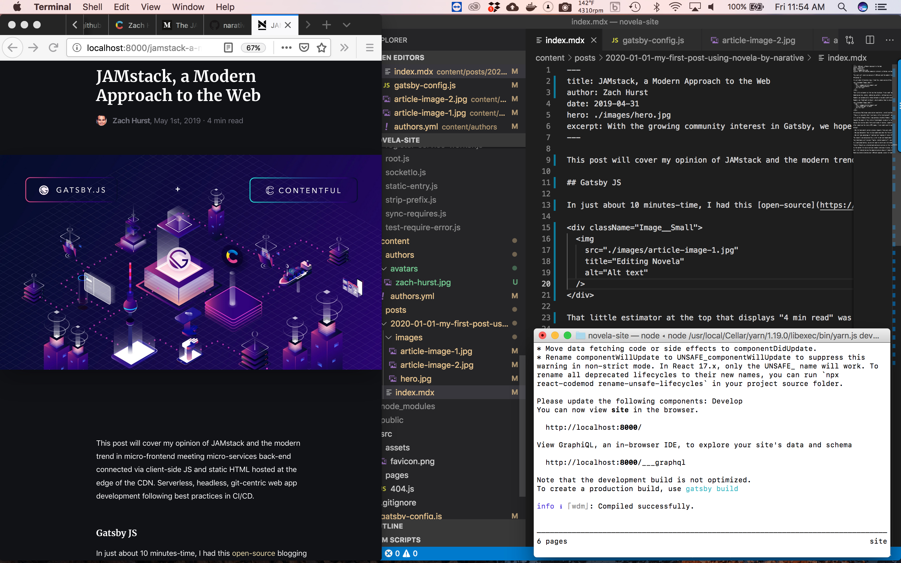
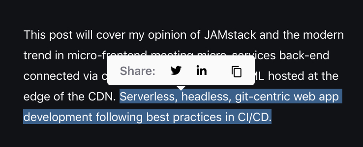

&nbsp;&nbsp;&nbsp;&nbsp;&nbsp;&nbsp;This post will cover my opinion of JAMstack and the modern trend of micro-frontend meeting micro-services back-end; connected via client-side Javascript and static HTML that's hosted at the edge of the CDN. Serverless, headless, git-centric, progressive web app development following best practices in CI/CD.

## The Great Gatsby JS 

&nbsp;&nbsp;&nbsp;&nbsp;&nbsp;&nbsp;In just about 10 minutes-time, I had this [open-source](https://novela.narative.co) blogging app for web downloaded, every dependency properly installed and I was editing React in VS Code: 

  

*^the embedded images will automatically expand if you click them :-)*

&nbsp;&nbsp;&nbsp;&nbsp;&nbsp;&nbsp;**Gatsby JS** made all of this possible, something I'll describe a bit more below. For now let me illustrate some of the amazing features that came pre-installed with this theme. 

&nbsp;&nbsp;&nbsp;&nbsp;&nbsp;&nbsp;That little estimator at the top that displays "4 min read" was automatically installed when I started. It even includes an animated bar that tracks the reader’s progress through every article that I generate. 

&nbsp;&nbsp;&nbsp;&nbsp;&nbsp;&nbsp;Updating my bio, avatar, adding new authors, configuring site meta-data, etc. was literally easier than editing a Myspace page. The posts are written in Markdown and Gatsby transforms them to HTML for me at compile time. 

&nbsp;&nbsp;&nbsp;&nbsp;&nbsp;&nbsp;Readers can automatically choose between a variable width grid or a simpler list style to display each story on my homepage and also toggle between light and dark mode for the entire theme. There's also a copy function at the top of every page that allows the reader to instantly copy the article link to their clipboard. 

&nbsp;&nbsp;&nbsp;&nbsp;&nbsp;&nbsp;Readers can "Highlight-to-Share", which enables them to select text within an article and instantly interact with a pop-up that'll copy the text or instantly import it into a supported platform like Twitter or LinkedIn. 

  

&nbsp;&nbsp;&nbsp;&nbsp;&nbsp;&nbsp;Activating a Mailchimp subscription newsletter, installing Google Analytics and attaching a headless CMS like Contentful only takes a few commands in shell. The plugins are pre-configured and just work. 

&nbsp;&nbsp;&nbsp;&nbsp;&nbsp;&nbsp;**How is it possible that I can have a fully-functioning**, dynamic **web app** built in React **with key blog functionality,** features like lazy-loading/code splitting, fully customized and ready for CDN publishing in **under an hour?** 

&nbsp;&nbsp;&nbsp;&nbsp;&nbsp;&nbsp;It's called [Themes](https://www.gatsbyjs.org/docs/themes/) for [Gatsby JS](https://www.gatsbyjs.org/) (one of the many **static, progressive web app generators**). The beauty of JAMstack solutions like Gatsby is that they follow the micro-front end trend which views a website or webapp as a composition of features. Compontentization like this enables independent teams to collaborate on different front-end features that are encapsulated as independent packages and merged together in the end. Compared to the old monolithic model, micro-frontends empower developers to work independently without concern of breaking the overall system. 

&nbsp;&nbsp;&nbsp;&nbsp;&nbsp;&nbsp;In this case a blogging app called Novella was published as a theme and I was able to download, install it and start manipulating the code in minutes. With Gatsby's "component shadowing", I can instantly replace any default component and style it however I want. 

&nbsp;&nbsp;&nbsp;&nbsp;&nbsp;&nbsp;Imagine the power of this style of development inside of a large organization. A marketing team may have different blogs for multiple divisions. By abstracting the data to the GraphQL layer with Gatsby, updating the functionality of the underlying web app becomes as easy as pushing out a simple install package vs. re-building the entire blog from the ground up. All the necessary dependencies are shipped and automatically installed with each theme!

&nbsp;&nbsp;&nbsp;&nbsp;&nbsp;&nbsp;Gatsby also unifies data ([content mesh](https://www.gatsbyjs.org/blog/2018-10-04-journey-to-the-content-mesh/)) from a multitude of sources, supports hot-reloading as you code and can ingest streams from just about any exposed API endpoint. Gatsby supports JSON, YAML, CSV, SaaS APIs, and more! That means I could quickly populate this site with data from an old Wordpress blog and still use WP as my CMS as an example. Out-of-the-box, Gatsby even supports auto-image-optimization for the responsive web.

&nbsp;&nbsp;&nbsp;&nbsp;&nbsp;&nbsp;After compiling the static HMTL pages, I pushed to my GitHub repository and let a PaaS hosting provider (in this case, [Netlify](https://www.netlify.com/)), continuously deploy the project to industry leading CDNs. By [abstracting](https://medium.com/memory-leak/the-jamstack-its-pretty-sweet-e0834e4e6bb7) the server functions and database actions, I can offload compute to my readers and stand to save a bundle on hosting costs! 

## Why?

- Why let bare-metal servers process requests from users when the "service workers" in their modern browser and Javascript runtime environment can directly handle communication with your micro-service vendors like Mailchimp, Stripe, Twilio, etc.? 

- Why pay datacenter fees to play middle-man when the free alternative is unmeasurably safer? Best case, the hacker defaces your static HTML page in this setup. They aren't injecting a credit card scraper (like with those old Magento builds) and siphoning out customer data because it never resides on your servers! 

- Why not take advantage of the blazing-quick load times of static HTML on the edge? Imagine how well Google will score your site for SEO when it resolves in less than a second on mobile 3g and only render-critical assets populate as your users scroll.

&nbsp;&nbsp;&nbsp;&nbsp;&nbsp;&nbsp;The reason I am explaining this is not to get you hyped about deploying a blog using this free, open-source theme (although you should consider it for fun). **I'm encouraging everyone to upgrade their** legacy **systems, de-couple back-end from front-end and migrate to a static, PWA architecture.** 

&nbsp;&nbsp;&nbsp;&nbsp;&nbsp;&nbsp;Your developers will be more **agile, content-agnostic**, your site will be performance tuned/**lightning fast** and most importantly --  it'll be much **more secure!**

&nbsp;&nbsp;&nbsp;&nbsp;&nbsp;&nbsp;As I mentioned before, you do not need to ditch your old vendors. You can keep an existing Shopify store to power your eCommerce back-end functionality but design your own front-end, which will render the products/shopping cart experience the way one of the traditional Shopify themes might. In this model you can have multiple layouts that pull from the same store. Your mobile site may include different functionality than your desktop site. 

&nbsp;&nbsp;&nbsp;&nbsp;&nbsp;&nbsp;Think of Shopify as a hosted back-end micro-service in this case that can be interchanged or augmented by other functions. Imagine a product review article from your Wordpress blog with a buy button baked in from your Shopify store. The user reads your article and completes the transaction on a custom page. Users may never realize Wordpress or Shopify were even involved but they successfully acted as back-end microservices anyway, ultimately powering the complete experience for your customer.

&nbsp;&nbsp;&nbsp;&nbsp;&nbsp;&nbsp;As the market for micro-services vendors continues to grow, it'll become increasingly easier for basic web-sites to incorporate complex features and functionality spanning user authentication, social networking, media playback, encrypted messaging, etc. as well as integrate AI-related services for things like NSFW image detection, language translation, text summarization, sentiment analysis, spam filtering, product recommendations, deep-fake detection, etc. The list of possibilities are literally endless.

&nbsp;&nbsp;&nbsp;&nbsp;&nbsp;&nbsp;Don't fall behind during the democratization phase of [SaaS](https://techcrunch.com/2019/09/06/apis-are-the-next-big-saas-wave/). Leverage client-side **Javascript**, re-usable **APIs** and pre-built **Markup** in your builds. The **JAM**stack has rapidly matured over the previous four years and is now primed and ready for your swift adoption.

&nbsp;&nbsp;&nbsp;&nbsp;&nbsp;&nbsp;Final note - Gatsby just [raised](https://venturebeat.com/2019/09/26/gatsby-raises-15-million-for-website-and-web-app-development-tools/) $15mm in venture capital and actively offers enterprise consulting services for larger sites.
